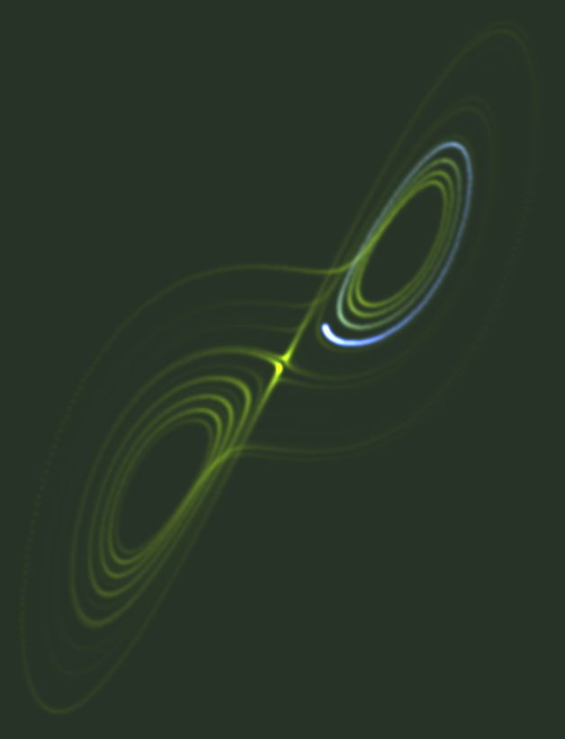
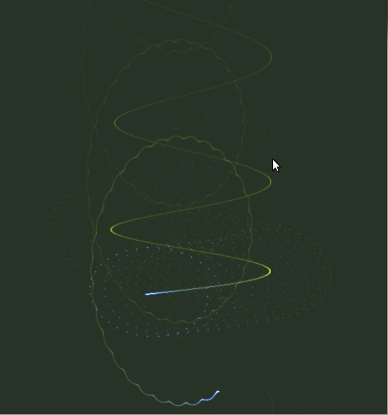

# CRT simulation

Random ideas:

- Simulate CRT inspired by physical models
- Run on GPU
- Vector displays:
  - DEC Type 30
  - DEC Type 340
  - DEC experimental color scope
  - DEC GT40
  - Bell Labs' Grafic II, Imlac
  - Tom Knight's NG Display
  - Imlac PDS-1
  - III vector display
- Raster displays:
  - Tom Knight's AI TV display
  - Ron Lebel's Logo TV display
  - DEC VT220
  - DataDisc display
- Target software:
  - SIMH
  - Papenhoff's PDP-6 simulator
  - Papenhoff's Knight TV emulator
  - Standalone program
  - WebGL program

### Sample images.

